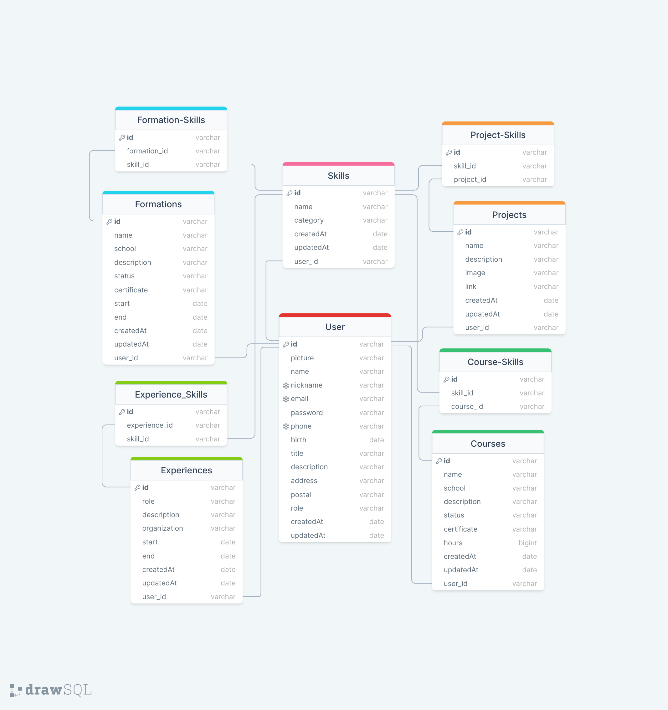

# [Profile Info](https://profile-info-panel.vercel.app) 🚀

Panel to manage personal infos from API



## Installation

```bash
$ npm install
```

## Running Panel

```bash
# production mode
$ npm run start

# development mode
$ npm run dev

# development turbo mode (unstable)
$ npm run dev:turbo
```

## Test

```bash
# unit tests
$ npm run test

# watch tests
$ npm run test:watch

# test coverage
$ npm run test:cov
```

## Features

- [x] Development Patterns (Clean Code, Clean Architecture, SOLID, KISS, DRY and YAGNI)
- [x] Development Configs (Formatters, Code Patterns, ESLint, Prettier, TSConfig and Husky)
- [x] SSR
- [x] Authentication (next-auth)
- [x] Fetch Configs (axios)
- [x] Query and Mutations (react-query)
- [ ] Cache and Memo Persist
- [x] Form Management and Validation (react-hook-form)
- [x] Form Schemas (zod)
- [x] Form Masks (imask)
- [x] Dark and White Theme (tailwind)
- [x] i18n (next-intl)
- [x] Error Boundary (Client)
- [x] Error Boundary (Server)
- [x] SDK From API
- [x] Roles (User and Admin)
- [x] Protected Pages (Public, Authenticated and By Role)
- [x] Multi Users (Protected)
- [x] Helpers Tests
- [ ] Translate Everything
- [x] [Deploy](https://profile-info-panel.vercel.app) 🚀

## Resources (Pages, Management, Tables and more...)

- [x] Auth
- [x] Home
- [x] Users
- [x] Skills
- [x] Projects
- [x] Formations
- [x] Courses
- [x] Experiences

## License

Nest is [MIT licensed](LICENSE).